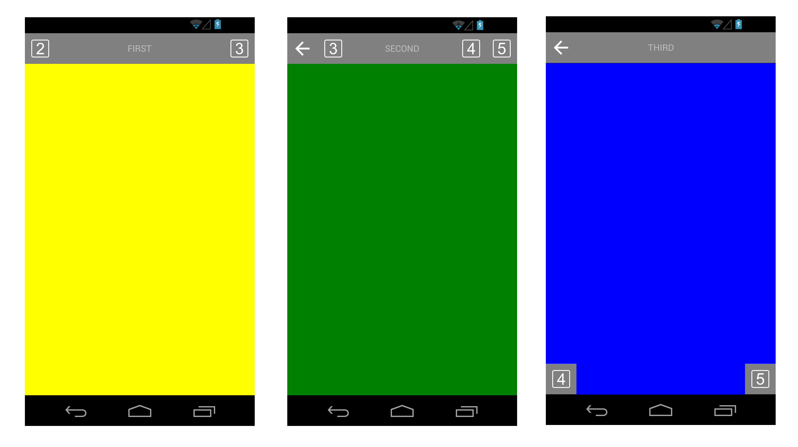
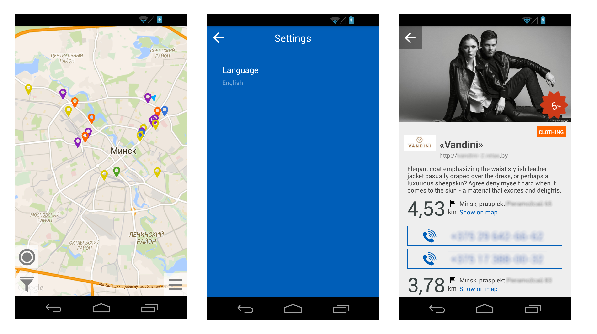

ScnTitleBar
======================
Customizable Xamarin.Forms title bar for Android & iOS: place up to 5 buttons inside it and position/paint the bar as you want.

Title Bar Control Structure
===========================================
The control may have the following items:
- Back button
- 1st left button
- 2nd left button
- Title
- 1st right button
- 2nd right button
 
You can put control in any place on a page and choose which items (out of the above list) to show. You may change icons, colors, title text and it's style. The "Back" button implements standard navigation action of each platform.

See schemas bellow:



Bellow you may see screenshots of a real application using the control (you can find sources of this application at https://github.com/ScienceSoft-Inc/XamarinDiscountsApp):


How to use this control in Xamarin.Forms app
===========================================
 Please pay attention that ScnTitleBar constuctor includes three parameters:
- Owner page;
- Kind of view buttons;
- Control alignment - to be used only for renderer not for location on a page.

You may find sample code of contral usage here: https://github.com/ScienceSoft-Inc/TitleBar/tree/master/ScnTitleBar/Sample/SampleTitleBar

As well mind that if you want to have responsive buttons (vibrating on tap) then you need to initialize renderers for each platform.

iOS:
```cs
Xamarin.Forms.Forms.Init ();
ViewGesturesRenderer.Init();
```
Android:
```cs
Xamarin.Forms.Forms.Init (this, bundle);
ViewGesturesRenderer.Init();
```
